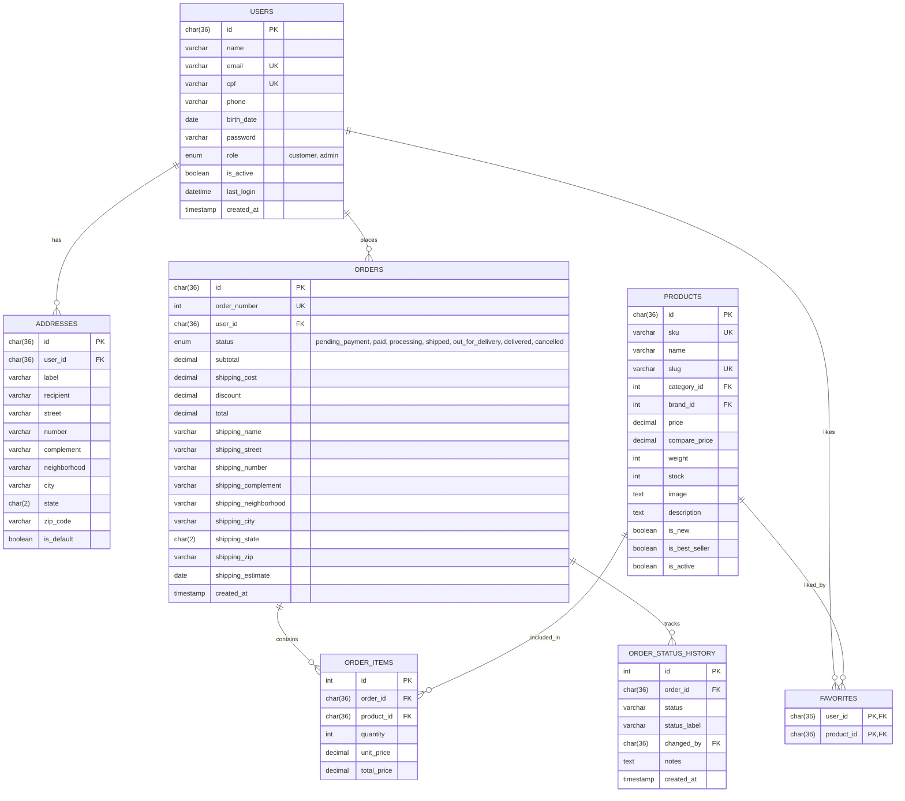

# ESSENZA — E-commerce System (v2.0)

Professional e-commerce platform for women's fashion and perfumaria, optimized for production on shared hosting (Hostinger) with a lightweight, secure PHP backend and modern vanilla JS/CSS frontend.

Production URL: [https://essenzamodaeperfumaria.com/](https://essenzamodaeperfumaria.com/)  
Local Dev Server: [http://localhost:5500](http://localhost:5500) (running Node.js with built-in mock database engine)

---

## 📂 Project Structure

```
├── database.sql               # Database schema (20 relational tables)
├── serve-local.cjs            # Local Node.js server with Mock API database
├── serve-local-db.json        # Persistent database for local testing
├── README.md                  # Detailed system documentation
└── public_html/               # Webroot folder to deploy on Hostinger
    ├── index.html             # Store Frontpage (catalog, cart, login modais)
    ├── minha-conta.html       # Customer Dashboard (profile, orders, addresses)
    ├── admin.html             # Admin Dashboard (stats, products CRUD, order manager)
    ├── styles.css             # Main styling & layout tokens
    ├── setup-admin.php        # Initial admin setup script (delete after use!)
    ├── .htaccess              # API Rewrite rules & security headers
    ├── css/
    │   ├── account.css        # Customer dashboard styles
    │   └── admin.css          # Admin dark theme panel styles
    ├── js/
    │   ├── app.js             # Store Core logic (catalog, pagination, API integration)
    │   ├── auth.js            # Authentication modais & session management
    │   ├── cart.js            # Mini-cart popups, WhatsApp checkout & syncing
    │   ├── account.js         # Addresses CRUD, profile edit, order toggles
    │   ├── orders.js          # Order helper wrappers
    │   └── admin.js           # Admin stats rendering, catalog CRUD & order status
    ├── includes/
    │   ├── .htaccess          # Deny direct access to config files
    │   ├── config.php         # Database credentials & server variables
    │   ├── database.php       # PDO MySQL singleton connector
    │   ├── helpers.php        # Clean UUID generator, masks & helpers
    │   ├── security.php       # Rate limiting, CSRF validation, XSS escaping
    │   └── auth-middleware.php# User session validator & roles checking
    └── api/
        ├── index.php          # Main API router (handles all /api/ routing)
        ├── auth.php           # Authentication endpoints (login, register, logout)
        ├── users.php          # User profile updater
        ├── addresses.php      # Customer address list & CRUD
        ├── products.php       # Product catalog CRUD
        ├── favorites.php      # Favorites storage
        ├── cart.php           # Persistent cart syncing
        └── admin.php          # Admin stats aggregation, order status updates
```

---

## 🗄️ Database Diagram

Below is the entity-relationship model of the Essenza system:



---

## 🔒 Security Features

1. **Password Hashing**: BCrypt (`password_hash` with `cost=12`) is strictly used on registration and login.
2. **SQL Injection Prevention**: Forced PDO prepared statements on all operations; no raw queries are permitted.
3. **CSRF Protection**: Tokens are generated on session start, sent with header `X-CSRF-Token` for `POST/PUT/DELETE` methods, and validated.
4. **XSS Protection**: HTML-safe escaping on all rendering. Content-Security-Policy (CSP) headers declared in `.htaccess`.
5. **Session Isolation**: Automated ID regeneration on login/logout. Inactive session timeout after 30 minutes.
6. **Rate Limiting**: Integrated rate limits on auth login attempts (max 5 attempts per 15 minutes by IP).

---

## ⚙️ How to Deploy on Hostinger

### Step 1: Database Setup
1. Log in to your Hostinger hPanel.
2. Go to **Databases > MySQL Databases** and create a database named `u560112854_essenza_banco`.
3. Open **phpMyAdmin** for this database.
4. Import the `database.sql` file. This creates all 20 tables and populates base products.

### Step 2: Code Upload
1. Upload the contents of the `public_html` directory directly into your Hostinger server's `/public_html/` root folder (keep files inside `css`, `js`, `includes`, `api` organized in subfolders).

### Step 3: Server Configuration
Ensure `public_html/includes/config.php` has correct MySQL credentials:
```php
define('DB_HOST', 'localhost');
define('DB_NAME', 'u560112854_essenza_banco');
define('DB_USER', 'u560112854_essenza');
define('DB_PASS', 'Donadel@10');
define('APP_ENV', 'production'); // Use 'development' for local PHP tests
```

### Step 4: Run Admin Setup Script
1. Navigate to: `https://essenzamodaeperfumaria.com/setup-admin.php`
2. This creates the initial admin user:
   - **User**: `admin@essenza.com`
   - **Password**: `2026`
3. **CRITICAL SECURITY REQUIREMENT**: Immediately delete the `setup-admin.php` file from the Hostinger server using File Manager.

---

## 💻 Local Testing & Development

You can test the entire platform locally without a PHP environment using the Node.js server wrapper:

1. Start the server (runs on port 5500):
   ```bash
   node serve-local.cjs
   ```
2. Open `http://localhost:5500` in your browser.
3. You can immediately log in with mock credentials:
   - **Customer Account**: `cliente@essenza.com` / Password: `123456`
   - **Administrator Account**: `admin@essenza.com` / Password: `2026`
4. The Node.js server persists registered users, addresses, orders, status changes, and catalog updates inside `serve-local-db.json`.
